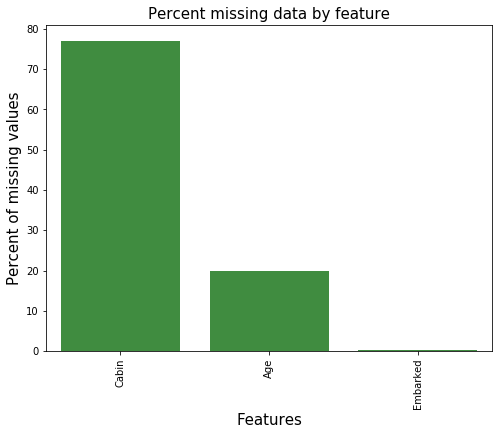
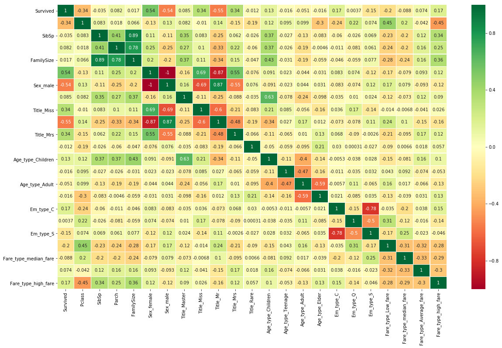
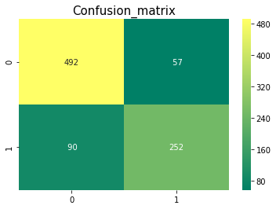
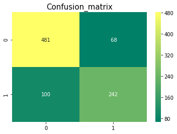

```python
# # Load the Drive helper and mount
# from google.colab import drive

# # This will prompt for authorization.
# drive.mount('/content/drive')
```

# 安装依赖库


```python
# 安装所有的库
# !pip install numpy 
# !pip install pandas 
# !pip install matplotlib 
# !pip install seaborn 
# !pip install scikit-learn 
# !pip install jupyter
```

# 数据探索


```python
# 导入库库
import numpy as np
import pandas as pd
import matplotlib.pyplot as plt
import seaborn as sns
import warnings
warnings.filterwarnings('ignore')
%matplotlib inline

```

# 加载数据


```python
# 加载数据
train_df = pd.read_csv('drive/My Drive/Colab Notebooks/titanic/train.csv')
train_df.head()
# train_df.describe()
# train_df.info()

# display(train_df.isnull().sum()) # 查看数据缺失
```


<div>
<style scoped>
    .dataframe tbody tr th:only-of-type {
        vertical-align: middle;
    }

    .dataframe tbody tr th {
        vertical-align: top;
    }
    
    .dataframe thead th {
        text-align: right;
    }
</style>
<table border="1" class="dataframe">
  <thead>
    <tr style="text-align: right;">
      <th></th>
      <th>PassengerId</th>
      <th>Survived</th>
      <th>Pclass</th>
      <th>Name</th>
      <th>Sex</th>
      <th>Age</th>
      <th>SibSp</th>
      <th>Parch</th>
      <th>Ticket</th>
      <th>Fare</th>
      <th>Cabin</th>
      <th>Embarked</th>
    </tr>
  </thead>
  <tbody>
    <tr>
      <th>0</th>
      <td>1</td>
      <td>0</td>
      <td>3</td>
      <td>Braund, Mr. Owen Harris</td>
      <td>male</td>
      <td>22.0</td>
      <td>1</td>
      <td>0</td>
      <td>A/5 21171</td>
      <td>7.2500</td>
      <td>NaN</td>
      <td>S</td>
    </tr>
    <tr>
      <th>1</th>
      <td>2</td>
      <td>1</td>
      <td>1</td>
      <td>Cumings, Mrs. John Bradley (Florence Briggs Th...</td>
      <td>female</td>
      <td>38.0</td>
      <td>1</td>
      <td>0</td>
      <td>PC 17599</td>
      <td>71.2833</td>
      <td>C85</td>
      <td>C</td>
    </tr>
    <tr>
      <th>2</th>
      <td>3</td>
      <td>1</td>
      <td>3</td>
      <td>Heikkinen, Miss. Laina</td>
      <td>female</td>
      <td>26.0</td>
      <td>0</td>
      <td>0</td>
      <td>STON/O2. 3101282</td>
      <td>7.9250</td>
      <td>NaN</td>
      <td>S</td>
    </tr>
    <tr>
      <th>3</th>
      <td>4</td>
      <td>1</td>
      <td>1</td>
      <td>Futrelle, Mrs. Jacques Heath (Lily May Peel)</td>
      <td>female</td>
      <td>35.0</td>
      <td>1</td>
      <td>0</td>
      <td>113803</td>
      <td>53.1000</td>
      <td>C123</td>
      <td>S</td>
    </tr>
    <tr>
      <th>4</th>
      <td>5</td>
      <td>0</td>
      <td>3</td>
      <td>Allen, Mr. William Henry</td>
      <td>male</td>
      <td>35.0</td>
      <td>0</td>
      <td>0</td>
      <td>373450</td>
      <td>8.0500</td>
      <td>NaN</td>
      <td>S</td>
    </tr>
  </tbody>
</table>
</div>


```python
# 查看数据缺失
def missingdata(data):
    total = data.isnull().sum().sort_values(ascending = False)
    percent = (data.isnull().sum()/data.isnull().count()*100).sort_values(ascending = False)
    ms=pd.concat([total, percent], axis=1, keys=['Total', 'Percent'])
    ms= ms[ms["Percent"] > 0]
    
    f,ax =plt.subplots(figsize=(8,6))
    plt.xticks(rotation='90')
    fig=sns.barplot(ms.index, ms["Percent"],color="green",alpha=0.8)
    
    plt.xlabel('Features', fontsize=15)
    plt.ylabel('Percent of missing values', fontsize=15)
    plt.title('Percent missing data by feature', fontsize=15)
    
    return ms
  
missingdata(train_df)


# display(train_df.isnull().sum()) # 查看数据缺失
```


<div>
<style scoped>
    .dataframe tbody tr th:only-of-type {
        vertical-align: middle;
    }

    .dataframe tbody tr th {
        vertical-align: top;
    }
    
    .dataframe thead th {
        text-align: right;
    }
</style>
<table border="1" class="dataframe">
  <thead>
    <tr style="text-align: right;">
      <th></th>
      <th>Total</th>
      <th>Percent</th>
    </tr>
  </thead>
  <tbody>
    <tr>
      <th>Cabin</th>
      <td>687</td>
      <td>77.104377</td>
    </tr>
    <tr>
      <th>Age</th>
      <td>177</td>
      <td>19.865320</td>
    </tr>
    <tr>
      <th>Embarked</th>
      <td>2</td>
      <td>0.224467</td>
    </tr>
  </tbody>
</table>
</div>





# 数据清洗


```python
train_df['Embarked'].fillna(train_df['Embarked'].mode()[0], inplace = True)
train_df['Age'].fillna(train_df['Age'].median(), inplace = True)

display(train_df.isnull().sum()) # 查看数据缺失
```


    PassengerId      0
    Survived         0
    Pclass           0
    Name             0
    Sex              0
    Age              0
    SibSp            0
    Parch            0
    Ticket           0
    Fare             0
    Cabin          687
    Embarked         0
    dtype: int64


```python
drop_column = ['Cabin']
train_df.drop(drop_column, axis=1, inplace = True)

display(train_df.isnull().sum()) # 查看数据缺失
```


```python
dataset = train_df

# 创建新的一列,成员数量(family size)
dataset['FamilySize'] = dataset['SibSp'] + dataset['Parch'] + 1
dataset.head()

    
# 处理姓名  
import re

# Define function to extract titles from passenger names
def get_title(name):
    title_search = re.search(' ([A-Za-z]+)\.', name)
    # If the title exists, extract and return it.
    if title_search:
        return title_search.group(1)
    return ""

# 创建 Title 列  
# Create a new feature Title, containing the titles of passenger names
dataset['Title'] = dataset['Name'].apply(get_title)
    
# Group all non-common titles into one single grouping "Rare"
dataset['Title'] = dataset['Title'].replace(['Lady', 'Countess','Capt', 'Col','Don', 
                                                 'Dr', 'Major', 'Rev', 'Sir', 'Jonkheer', 'Dona'], 'Rare')
dataset['Title'] = dataset['Title'].replace('Mlle', 'Miss')
dataset['Title'] = dataset['Title'].replace('Ms', 'Miss')
dataset['Title'] = dataset['Title'].replace('Mme', 'Mrs')
   
  
  
# 创建 bin 列，幼儿(0~14 岁)、⻘少年(14~20 岁)、成年人(20~40 岁)以及年⻓的人(40 岁以上)
dataset['Age_bin'] = pd.cut(dataset['Age'], bins=[0,14,20,40,120], labels=['Children','Teenage','Adult','Elder'])
# 创建 bin 列，票价
dataset['Fare_bin'] = pd.cut(dataset['Fare'], bins=[0,7.91,14.45,31,120], labels=['Low_fare','median_fare', 'Average_fare','high_fare'])


# 删除无用的例
drop_column = ['Age','Fare','Name','Ticket']
dataset.drop(drop_column, axis=1, inplace = True)
    
drop_column = ['PassengerId']
dataset.drop(drop_column, axis=1, inplace = True)

dataset.head()


# 重新组合数据，赋值给 traindf；
# 独热编码
traindf = pd.get_dummies(dataset, columns = ["Sex","Title","Age_bin","Embarked","Fare_bin"],
                             prefix=["Sex","Title","Age_type","Em_type","Fare_type"])
```


```python
# traindf.info()
```


```python
# 特征之间的相关性
sns.heatmap(traindf.corr(),annot=True,cmap='RdYlGn',linewidths=0.2) #data.corr()-->correlation matrix
fig=plt.gcf()
fig.set_size_inches(20,12)
plt.show()
```





```python
traindf.info()
```

    <class 'pandas.core.frame.DataFrame'>
    RangeIndex: 891 entries, 0 to 890
    Data columns (total 23 columns):
    Survived                  891 non-null int64
    Pclass                    891 non-null int64
    SibSp                     891 non-null int64
    Parch                     891 non-null int64
    FamilySize                891 non-null int64
    Sex_female                891 non-null uint8
    Sex_male                  891 non-null uint8
    Title_Master              891 non-null uint8
    Title_Miss                891 non-null uint8
    Title_Mr                  891 non-null uint8
    Title_Mrs                 891 non-null uint8
    Title_Rare                891 non-null uint8
    Age_type_Children         891 non-null uint8
    Age_type_Teenage          891 non-null uint8
    Age_type_Adult            891 non-null uint8
    Age_type_Elder            891 non-null uint8
    Em_type_C                 891 non-null uint8
    Em_type_Q                 891 non-null uint8
    Em_type_S                 891 non-null uint8
    Fare_type_Low_fare        891 non-null uint8
    Fare_type_median_fare     891 non-null uint8
    Fare_type_Average_fare    891 non-null uint8
    Fare_type_high_fare       891 non-null uint8
    dtypes: int64(5), uint8(18)
    memory usage: 50.5 KB


```python
traindf.head()
```


<div>
<style scoped>
    .dataframe tbody tr th:only-of-type {
        vertical-align: middle;
    }

    .dataframe tbody tr th {
        vertical-align: top;
    }
    
    .dataframe thead th {
        text-align: right;
    }
</style>
<table border="1" class="dataframe">
  <thead>
    <tr style="text-align: right;">
      <th></th>
      <th>Survived</th>
      <th>Pclass</th>
      <th>SibSp</th>
      <th>Parch</th>
      <th>FamilySize</th>
      <th>Sex_female</th>
      <th>Sex_male</th>
      <th>Title_Master</th>
      <th>Title_Miss</th>
      <th>Title_Mr</th>
      <th>...</th>
      <th>Age_type_Teenage</th>
      <th>Age_type_Adult</th>
      <th>Age_type_Elder</th>
      <th>Em_type_C</th>
      <th>Em_type_Q</th>
      <th>Em_type_S</th>
      <th>Fare_type_Low_fare</th>
      <th>Fare_type_median_fare</th>
      <th>Fare_type_Average_fare</th>
      <th>Fare_type_high_fare</th>
    </tr>
  </thead>
  <tbody>
    <tr>
      <th>0</th>
      <td>0</td>
      <td>3</td>
      <td>1</td>
      <td>0</td>
      <td>2</td>
      <td>0</td>
      <td>1</td>
      <td>0</td>
      <td>0</td>
      <td>1</td>
      <td>...</td>
      <td>0</td>
      <td>1</td>
      <td>0</td>
      <td>0</td>
      <td>0</td>
      <td>1</td>
      <td>1</td>
      <td>0</td>
      <td>0</td>
      <td>0</td>
    </tr>
    <tr>
      <th>1</th>
      <td>1</td>
      <td>1</td>
      <td>1</td>
      <td>0</td>
      <td>2</td>
      <td>1</td>
      <td>0</td>
      <td>0</td>
      <td>0</td>
      <td>0</td>
      <td>...</td>
      <td>0</td>
      <td>1</td>
      <td>0</td>
      <td>1</td>
      <td>0</td>
      <td>0</td>
      <td>0</td>
      <td>0</td>
      <td>0</td>
      <td>1</td>
    </tr>
    <tr>
      <th>2</th>
      <td>1</td>
      <td>3</td>
      <td>0</td>
      <td>0</td>
      <td>1</td>
      <td>1</td>
      <td>0</td>
      <td>0</td>
      <td>1</td>
      <td>0</td>
      <td>...</td>
      <td>0</td>
      <td>1</td>
      <td>0</td>
      <td>0</td>
      <td>0</td>
      <td>1</td>
      <td>0</td>
      <td>1</td>
      <td>0</td>
      <td>0</td>
    </tr>
    <tr>
      <th>3</th>
      <td>1</td>
      <td>1</td>
      <td>1</td>
      <td>0</td>
      <td>2</td>
      <td>1</td>
      <td>0</td>
      <td>0</td>
      <td>0</td>
      <td>0</td>
      <td>...</td>
      <td>0</td>
      <td>1</td>
      <td>0</td>
      <td>0</td>
      <td>0</td>
      <td>1</td>
      <td>0</td>
      <td>0</td>
      <td>0</td>
      <td>1</td>
    </tr>
    <tr>
      <th>4</th>
      <td>0</td>
      <td>3</td>
      <td>0</td>
      <td>0</td>
      <td>1</td>
      <td>0</td>
      <td>1</td>
      <td>0</td>
      <td>0</td>
      <td>1</td>
      <td>...</td>
      <td>0</td>
      <td>1</td>
      <td>0</td>
      <td>0</td>
      <td>0</td>
      <td>1</td>
      <td>0</td>
      <td>1</td>
      <td>0</td>
      <td>0</td>
    </tr>
  </tbody>
</table>
<p>5 rows × 23 columns</p>
</div>


# 建模

## 拆分数据


```python
from sklearn.model_selection import train_test_split #for split the data
from sklearn.metrics import accuracy_score  #for accuracy_score
from sklearn.model_selection import KFold #for K-fold cross validation
from sklearn.model_selection import cross_val_score #score evaluation
from sklearn.model_selection import cross_val_predict #prediction
from sklearn.metrics import confusion_matrix #for confusion matrix

# 拆分特征列和预测列
all_features = traindf.drop("Survived",axis=1)
Targeted_feature = traindf["Survived"]

# 拆分数据
X_train,X_test,y_train,y_test = train_test_split(all_features,Targeted_feature,test_size=0.3,random_state=42)

# 打印数据大小
X_train.shape,X_test.shape,y_train.shape,y_test.shape
```


    ((623, 22), (268, 22), (623,), (268,))


## 建模-随机森林算法


```python
from sklearn.ensemble import RandomForestClassifier

model = RandomForestClassifier(criterion='gini', n_estimators=700,
                             min_samples_split=10,min_samples_leaf=1,
                             max_features='auto',oob_score=True,
                             random_state=1,n_jobs=-1)

model.fit(X_train,y_train)
prediction_rm = model.predict(X_test)
print('--------------The Accuracy of the model----------------------------')
print('The accuracy of the Random Forest Classifier is', round(accuracy_score(prediction_rm,y_test)*100,2))

# 把数据分成 10 个变量,计算所有分数的均值
kfold = KFold(n_splits=10, random_state=22) # k=10, split the data into 10 equal parts
result_rm = cross_val_score(model,all_features,Targeted_feature,cv=10,scoring='accuracy')
print('The cross validated score for Random Forest Classifier is:',round(result_rm.mean()*100,2))


# 绘图展示
y_pred = cross_val_predict(model,all_features,Targeted_feature,cv=10)
sns.heatmap(confusion_matrix(Targeted_feature,y_pred),annot=True,fmt='3.0f',cmap="summer")
plt.title('Confusion_matrix', y=1.05, size=15)

```

    --------------The Accuracy of the model----------------------------
    The accuracy of the Random Forest Classifier is 82.09
    The cross validated score for Random Forest Classifier is: 83.51


    Text(0.5, 1.05, 'Confusion_matrix')





## 优化


```python
from sklearn.model_selection import GridSearchCV

# Random Forest Classifier Parameters tunning 
model = RandomForestClassifier()
n_estim=range(100,5000,100)

## Search grid for optimal parameters
param_grid = {"n_estimators" :n_estim}
model_rf = GridSearchCV(model, param_grid = param_grid, cv=5, scoring="accuracy", n_jobs= 4, verbose = 1)
model_rf.fit(X_train, y_train)

# Best score
print(model_rf.best_score_)

#best estimator
model_rf.best_estimator_
```

    Fitting 5 folds for each of 49 candidates, totalling 245 fits


    [Parallel(n_jobs=4)]: Using backend LokyBackend with 4 concurrent workers.
    [Parallel(n_jobs=4)]: Done  42 tasks      | elapsed:   23.3s
    [Parallel(n_jobs=4)]: Done 192 tasks      | elapsed:  6.2min
    [Parallel(n_jobs=4)]: Done 245 out of 245 | elapsed:  9.9min finished


    0.8154093097913323


    RandomForestClassifier(bootstrap=True, class_weight=None, criterion='gini',
                max_depth=None, max_features='auto', max_leaf_nodes=None,
                min_impurity_decrease=0.0, min_impurity_split=None,
                min_samples_leaf=1, min_samples_split=2,
                min_weight_fraction_leaf=0.0, n_estimators=1400, n_jobs=None,
                oob_score=False, random_state=None, verbose=0,
                warm_start=False)


## 再次训练


```python
# 使用优化过后的模块再次训练

from sklearn.ensemble import RandomForestClassifier

# model = RandomForestClassifier(bootstrap=True, class_weight=None, criterion='gini',
#             max_depth=None, max_features='auto', max_leaf_nodes=None,
#             min_impurity_decrease=0.0, min_impurity_split=None,
#             min_samples_leaf=1, min_samples_split=2,
#             min_weight_fraction_leaf=0.0, n_estimators=700, n_jobs=None,
#             oob_score=False, random_state=None, verbose=0,
#             warm_start=False)

RandomForestClassifier(bootstrap=True, class_weight=None, criterion='gini',
            max_depth=None, max_features='auto', max_leaf_nodes=None,
            min_impurity_decrease=0.0, min_impurity_split=None,
            min_samples_leaf=1, min_samples_split=2,
            min_weight_fraction_leaf=0.0, n_estimators=1400, n_jobs=None,
            oob_score=False, random_state=None, verbose=0,
            warm_start=False)

model.fit(X_train,y_train)
prediction_rm = model.predict(X_test)
print('--------------The Accuracy of the model----------------------------')
print('The accuracy of the Random Forest Classifier is', round(accuracy_score(prediction_rm,y_test)*100,2))

# 把数据分成 10 个变量,计算所有分数的均值
kfold = KFold(n_splits=10, random_state=22) # k=10, split the data into 10 equal parts
result_rm = cross_val_score(model,all_features,Targeted_feature,cv=10,scoring='accuracy')
print('The cross validated score for Random Forest Classifier is:',round(result_rm.mean()*100,2))


# 绘图展示
y_pred = cross_val_predict(model,all_features,Targeted_feature,cv=10)
sns.heatmap(confusion_matrix(Targeted_feature,y_pred),annot=True,fmt='3.0f',cmap="summer")
plt.title('Confusion_matrix', y=1.05, size=15)

```

    --------------The Accuracy of the model----------------------------
    The accuracy of the Random Forest Classifier is 76.12
    The cross validated score for Random Forest Classifier is: 81.82


    Text(0.5, 1.05, 'Confusion_matrix')





发现分数反而降低了，说明优化不够。
